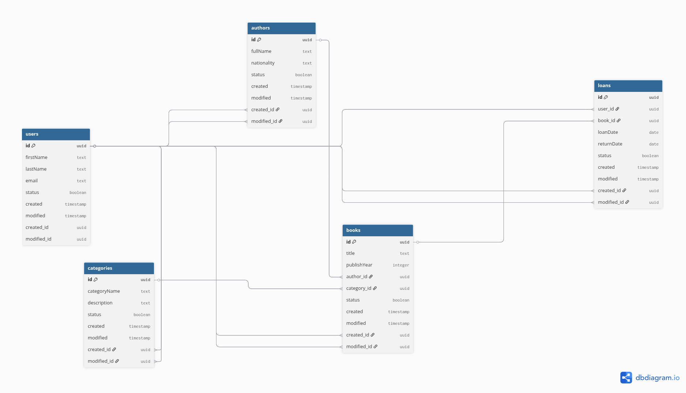

##  1. Modelo Lógico (Diagrama Entidad-Relación - DER)

El siguiente diagrama representa de forma gráfica cómo se conectan las tablas de nuestra biblioteca.



---
### Creación de la Tablas:

Creamos la tabla `users` 

```sql
-- TABLA 1: users 
CREATE TABLE users (
    id UUID PRIMARY KEY DEFAULT gen_random_uuid(),
    first_name TEXT NOT NULL,
    last_name TEXT NOT NULL,
    email TEXT UNIQUE NOT NULL,
    is_admin BOOLEAN DEFAULT false,
    
    -- Columnas obligatorias de auditoría
    status BOOLEAN DEFAULT true,
    created TIMESTAMP WITH TIME ZONE DEFAULT now(),
    modified TIMESTAMP WITH TIME ZONE DEFAULT now(),
    created_id UUID, 
    modified_id UUID
);

-- TABLA 2: authors
CREATE TABLE authors (
    id UUID PRIMARY KEY DEFAULT gen_random_uuid(),
    full_name TEXT NOT NULL,
    nationality TEXT,
    
    -- Columnas obligatorias de auditoría
    status BOOLEAN DEFAULT true,
    created TIMESTAMP WITH TIME ZONE DEFAULT now(),
    modified TIMESTAMP WITH TIME ZONE DEFAULT now(),
    created_id UUID REFERENCES users(id),
    modified_id UUID REFERENCES users(id)
);

-- TABLA 3: categories 
CREATE TABLE categories (
    id UUID PRIMARY KEY DEFAULT gen_random_uuid(),
    category_name TEXT NOT NULL,
    description TEXT,
    
    -- Columnas obligatorias de auditoría
    status BOOLEAN DEFAULT true,
    created TIMESTAMP WITH TIME ZONE DEFAULT now(),
    modified TIMESTAMP WITH TIME ZONE DEFAULT now(),
    created_id UUID REFERENCES users(id),
    modified_id UUID REFERENCES users(id)
);

-- TABLA 4: books 
CREATE TABLE books (
    id UUID PRIMARY KEY DEFAULT gen_random_uuid(),
    title TEXT NOT NULL,
    publish_year INTEGER,
    
    -- Llaves foráneas (1 a muchos)
    author_id UUID REFERENCES authors(id) ON DELETE RESTRICT,
    category_id UUID REFERENCES categories(id) ON DELETE RESTRICT,
    
    -- Columnas obligatorias de auditoría
    status BOOLEAN DEFAULT true,
    created TIMESTAMP WITH TIME ZONE DEFAULT now(),
    modified TIMESTAMP WITH TIME ZONE DEFAULT now(),
    created_id UUID REFERENCES users(id),
    modified_id UUID REFERENCES users(id)
);

-- TABLA 5: book_copies
CREATE TABLE book_copies (
    id UUID PRIMARY KEY DEFAULT gen_random_uuid(),
    book_id UUID NOT NULL REFERENCES books(id) ON DELETE RESTRICT, 
    barcode TEXT UNIQUE NOT NULL,
    physical_condition TEXT NOT NULL DEFAULT 'Bueno', -- Ejemplos: 'Bueno', 'Dañado', 'Desgastado'
    is_available BOOLEAN NOT NULL DEFAULT true,
    
    -- Columnas obligatorias de auditoría
    status BOOLEAN DEFAULT true,
    created TIMESTAMP WITH TIME ZONE DEFAULT now(),
    modified TIMESTAMP WITH TIME ZONE DEFAULT now(),
    created_id UUID REFERENCES users(id),
    modified_id UUID REFERENCES users(id)
);

-- TABLA 6: loans
CREATE TABLE loans (
    id UUID PRIMARY KEY DEFAULT gen_random_uuid(),
    user_id UUID REFERENCES users(id) ON DELETE RESTRICT,
    book_copy_id UUID REFERENCES book_copies(id) ON DELETE RESTRICT, 
    loan_date DATE NOT NULL DEFAULT current_date,
    due_date DATE NOT NULL DEFAULT (current_date + INTERVAL '14 days'),
    return_date DATE,
    loan_status TEXT NOT NULL DEFAULT 'Activo', -- Ejemplos: 'Activo', 'Devuelto', 'Vencido'
    notes TEXT,
    
    -- Columnas obligatorias de auditoría
    status BOOLEAN DEFAULT true,
    created TIMESTAMP WITH TIME ZONE DEFAULT now(),
    modified TIMESTAMP WITH TIME ZONE DEFAULT now(),
    created_id UUID REFERENCES users(id),
    modified_id UUID REFERENCES users(id)
);

