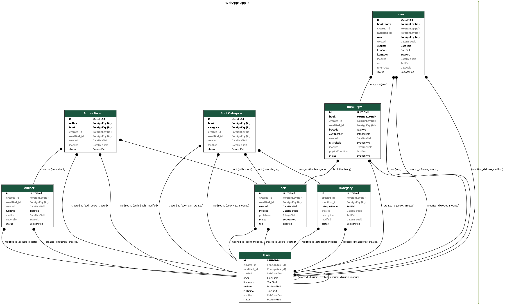
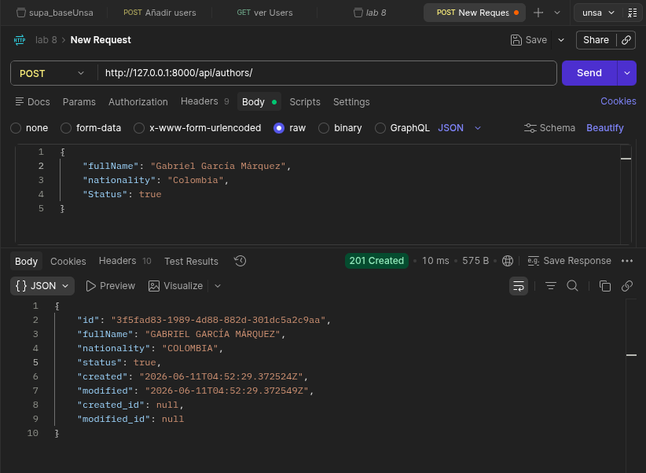
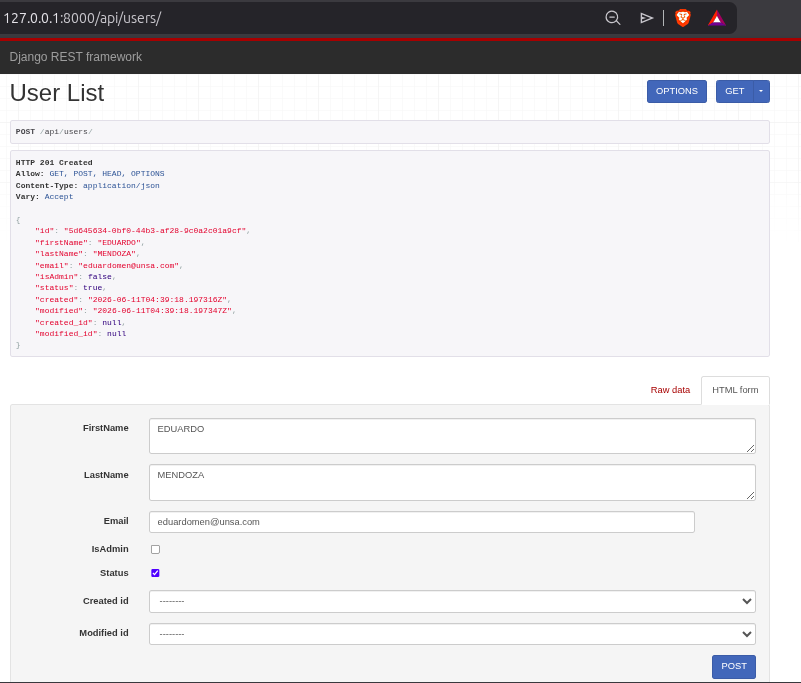
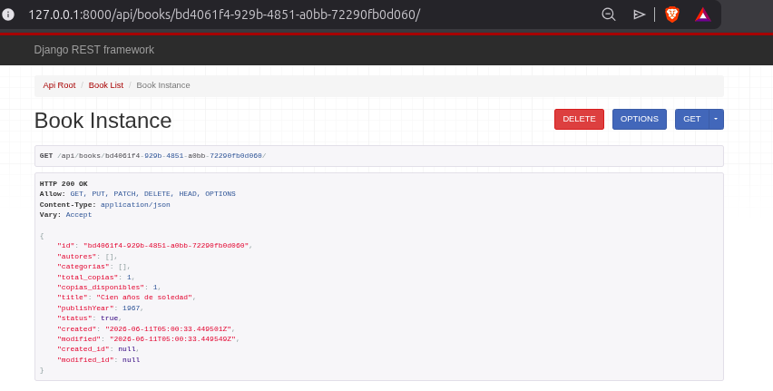
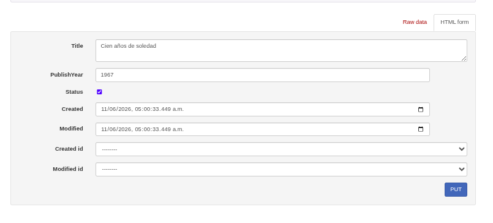

# Laboratorio 08 : Django REST Framework
| Autores |
| :--- | 
| Jafet Macedo Orozco | 
| Angel Paúl Apaza Nazareth | 
| Eddy Alvaro Muto Montesinos | 


#  Sistema de Gestión de Biblioteca (sislib)

Este proyecto corresponde al desarrollo del backend para el sistema de gestión de una biblioteca, implementado con **Django** como framework principal.

## Modelo ERD

##  Requisitos e Instalación

### 1. Activar el Entorno Virtual
Asegúrese de inicializar su entorno virtual antes de ejecutar los comandos del framework.

**En GNU/Linux:**
```bash
source my_env/bin/activate
```
**En MS Windows:**
```bash
source my_env/bin/activate
my_env\Scripts\activate.bat
```
### 2. Instalar dependencias
Instale Django REST Framework y los componentes necesarios registrados en el archivo de requerimientos:
```bash
pip install -r requirements.txt
```
### 3. Aplicar Migraciones
```bash
python manage.py makemigrations
python manage.py migrate
```
### 4. Desplegar el navegador
```bash
python manage.py runserver
```

## Serializadores

### 1. Serializadores planos
Se implementaron clases basadas en serializers.ModelSerializer para las entidades del proyecto. Estos serializadores procesan la información de manera plana (mapeando llaves foráneas únicamente como IDs primitivos) optimizando operaciones de escritura (POST/PUT):

- UserSerializer (en UsersSerializer.py)

- AuthorSerializer (en AuthorsSerializer.py)

- CategorySerializer (en CategoriesSerializer.py)

- BooksSerializer (en BooksSerializer.py)

- BookCopySerializer (en BookCopiesSerializer.py)

- LoanSerializer (en LoansSerializer.py)

#### codigo de muestra UserSerializer.py
```bash
from rest_framework import serializers
from ..models.users import User

class UserSerializer(serializers.ModelSerializer):
    class Meta:
        model = User
        fields = '__all__'
```
### 2. Serializadores anidados
Se implementaron clases basadas en serializers.ModelSerializer para las entidades del proyecto. Estos serializadores procesan la información de manera plana (mapeando llaves foráneas únicamente como IDs primitivos) optimizando operaciones de escritura (POST/PUT):

- LoanDetailSerializer

- BookDetailSerializer
#### codigo de muestra BookDetailSerializer.py

```bash
from rest_framework import serializers
from .BookSerializer import BookSerializer
from ..models.authors_books import AuthorBook
from ..models.books_categories import BookCategory
from ..models.book_copies import BookCopy

class BookDetailSerializer(BookSerializer):
    autores = serializers.SerializerMethodField()
    categorias = serializers.SerializerMethodField()
    total_copias = serializers.SerializerMethodField()
    copias_disponibles = serializers.SerializerMethodField()

    class Meta(BookSerializer.Meta):
        fields = '__all__'

    def get_autores(self, obj):
        # Buscamos las relaciones activas con autores
        relaciones = AuthorBook.objects.filter(book=obj, status=True)
        return [{"id": rel.author.id, "fullName": rel.author.fullName} for rel in relaciones]

    def get_categorias(self, obj):
        # Buscamos las relaciones activas con categorías
        relaciones = BookCategory.objects.filter(book=obj, status=True)
        return [{"id": rel.category.id, "categoryName": rel.category.categoryName} for rel in relaciones]

    def get_total_copias(self, obj):
        # Cuenta cuántas copias físicas existen de este libro en el inventario
        return BookCopy.objects.filter(book=obj, status=True).count()

    def get_copias_disponibles(self, obj):
        # Cuenta cuántas de esas copias están listas para prestarse (is_available=True)
        return BookCopy.objects.filter(book=obj, is_available=True, status=True).count()
```
## Vistas
En lugar de un archivo `views.py` monolítico, se implementó una **carpeta modular de vistas** (`WebApps/applib/views/`) estructurada como un paquete de Python mediante un archivo centralizador `__init__.py`. 

Cada recurso cuenta con su propio controlador basado en `viewsets.ModelViewSet`, lo que facilita el mantenimiento del software y el manejo limpio del CRUD:
* `UserViews.py` -> `UserViewSet`
* `AuthorViews.py` -> `AuthorViewSet`
* `CategoryViews.py` -> `CategoryViewSet`
* `BookViews.py` -> `BookViewSet`
* `BookCopiesViews.py` -> `BookCopyViewSet`
* `LoanViews.py` -> `LoanViewSet`

Soportan de forma nativa las operaciones HTTP estándar vinculadas al ORM: `GET` (List/Retrieve), `POST` (Create), `PUT` (Update) y `DELETE` (Destroy).

---


## Endpoints de la API REST

| Método HTTP        | Endpoint               | Descripción                                                                                                                                |
| ------------------ | ---------------------- | ------------------------------------------------------------------------------------------------------------------------------------------ |
| GET / POST         | `/api/users`           | Listar usuarios / Registrar un nuevo usuario (Modo Plano).                                                                                 |
| GET / PUT / DELETE | `/api/users/{id}`      | Detalle, actualización y eliminación de un usuario por UUID.                                                                               |
| GET / POST         | `/api/authors`         | Listar autores / Registrar un nuevo autor.                                                                                                 |
| GET / PUT / DELETE | `/api/authors/{id}`    | Detalle, actualización y eliminación de un autor.                                                                                          |
| GET / POST         | `/api/categories`      | Listar categorías / Registrar una categoría literaria.                                                                                     |
| GET / PUT / DELETE | `/api/categories/{id}` | Detalle, actualización y eliminación de una categoría.                                                                                     |
| GET / POST         | `/api/books`           | Listar libros (Modo Plano) / Registrar un nuevo libro.                                                                                     |
| GET                | `/api/books/{id}`      | Consulta Compleja (Detalle Anidado): muestra el libro con sus copias físicas asociadas.                                                    |
| GET / POST         | `/api/book-copies`     | Listar copias de libros / Registrar una copia física.                                                                                      |
| GET / POST         | `/api/loans`           | Listar préstamos activos / Registrar un nuevo préstamo.                                                                                    |
| GET                | `/api/loans/{id}`      | Consulta Compleja (Detalle Anidado): devuelve el préstamo junto con la información detallada del usuario y la copia del libro involucrada. |

## Permisos
Para facilitar el testeo del CRUD completo sin requerir de un flujo rígido de tokens de sesión JWT en esta fase del laboratorio, se configuró la seguridad de manera global en settings.py permitiendo accesos anónimos:

```bash
REST_FRAMEWORK = {
    'DEFAULT_PERMISSION_CLASSES': [
        'rest_framework.permissions.AllowAny',
    ],
}
```
## Evidencias de Funcionamiento (Pruebas de la API)
La API cuenta con soporte de interfaz interactiva navegable. Puede ser probada ingresando desde cualquier navegador a:
http://127.0.0.1:8000/api/


Para demostrar el correcto funcionamiento del CRUD y el cumplimiento de las directrices pedagógicas, se realizaron pruebas cruzadas utilizando tanto **Postman** como la **interfaz web interactiva** de Django REST Framework.

### 1. Creación de Entidades desde Postman (`POST /api/authors/`)
Se validó la inserción de registros enviando solicitudes HTTP `POST` con cuerpos de datos estructurados en formato JSON crudo (*raw JSON*). El servidor procesa la información de manera correcta, retorna un estado de respuesta `201 Created` y genera de forma automática el identificador único (UUID) para el registro.




### 2. Formulario de Inserción Nativo (`POST /api/users/`)
Haciendo uso de la interfaz web navegable del framework, se comprobó el flujo de registro síncrono para la entidad de Usuarios. El sistema renderiza dinámicamente los formularios HTML mapeados desde el serializador plano, permitiendo una persistencia limpia en el backend.



### 3. Consulta Compleja - Detalle JSON Anidado (`GET /api/books/[UUID]/`)
Cumpliendo estrictamente con los **Puntos 3 y 7 de la rúbrica**, se realizó una petición de detalle `GET` a un libro específico. 

En lugar de devolver únicamente los IDs planos de las relaciones, el `BookDetailSerializer` intercepta la consulta y expande dinámicamente el árbol JSON, inyectando la información completa de todas las copias físicas (`book-copies`) asociadas a ese libro en una única respuesta estructurada.


